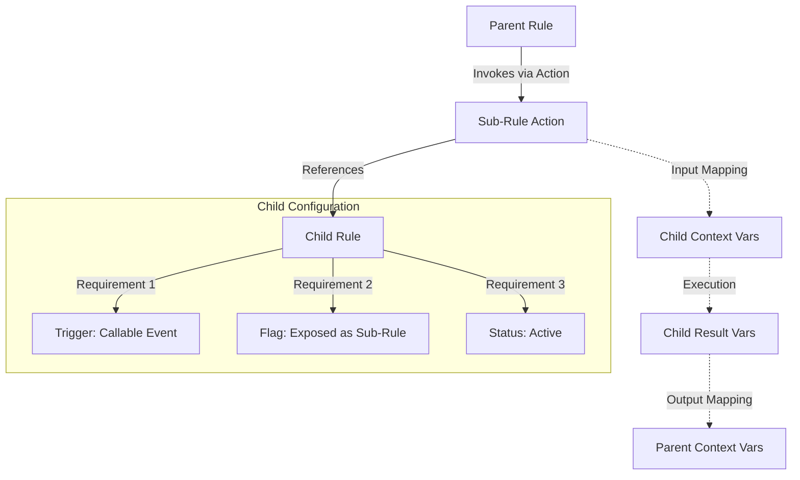
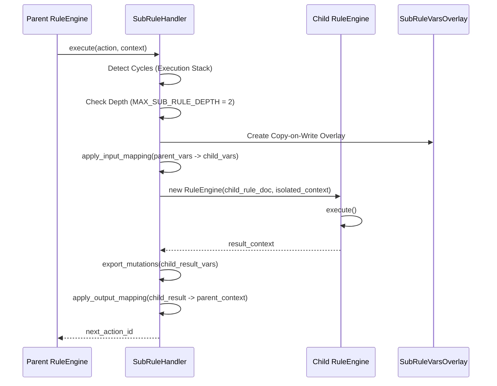

# FlexiRule Sub-Rule Architecture Deep Dive & Implementation Report

## Executive Summary
FlexiRule Sub-Rules enable modular and reusable business logic by allowing one rule to invoke another as a discrete step in its flow. This report provides a comprehensive analysis of the current implementation (v1.0), covering the data model, execution mechanics, validation logic, and frontend integration. The system is found to be robust in terms of execution isolation and cycle detection but relies on implicit contracts (Jinja scanning) rather than explicit interface definitions.

---

## 1. Architecture Overview
The Sub-Rule feature follows a delegation-based component model. Rules are not inherently different based on their "sub-rule" status; instead, any Rule can act as a component if it opts into a specific configuration.

### Relationship Diagram

---

## 2. Data Model Analysis

### Rule DocType (`rule.json`)
A rule becomes a "Sub-Rule" when the following fields are set:
- **`trigger_type`**: Must be **"Callable Event"**. This detaches the rule from standard DocType hooks (e.g., "Before Save") and makes it purely invocable by name.
- **`exposed_as_subrule`**: A boolean flag (`Check`) that acts as a discovery filter. Only rules with this flag enabled appear in the Rule Builder's selection UI.

### Rule Action DocType (`rule_action.json`)
The invocation is handled by a specific action type:
- **`action_type`**: **"Sub-Rule"**.
- **`rule`**: A Link field to the `Rule` DocType, filtered to only show active, callable, and exposed rules.
- **`config`**: A JSON blob storing:
    - `sub_rule_name`: Redundant storage of the target rule name.
    - `input_mapping`: Array of `{source, target}` pairs for context propagation.
    - `output_mapping`: Array of `{source, target}` pairs for result retrieval.

---

## 3. Runtime Execution Flow

Execution is orchestrated by the `SubRuleHandler` which manages context isolation and recursive depth protection.

### Sequence Diagram

### Key Execution Mechanics
- **Context Isolation**: Uses `SubRuleVarsOverlay` (in `sub_rule.py`). This dictionary-like object allows the child rule to *read* parent variables but ensures that all *writes* stay local to the child execution unless explicitly mapped back.
- **Cycle Detection**:
    1. **Structural**: Checked at save time via DFS in `Rule.validate_no_sub_rule_cycles`.
    2. **Runtime**: `SubRuleHandler` maintains an `execution_stack` in the `meta` context. If a rule name is already in the stack, a `CycleDetectedError` is raised.
- **Depth Protection**: Hardcoded `MAX_SUB_RULE_DEPTH = 2` prevents runaway recursion.

---

## 4. End-to-End Trace Example

Scenario: `Parent Rule` (On Sales Invoice Save) calls `Calculate Discount` (Sub-Rule).

### Step 1: Configuration (Frontend)
1.  **User** opens `Parent Rule` in Rule Builder.
2.  **User** adds a `Sub-Rule` action node.
3.  **Frontend** (`SubRuleNodeConfig.vue`) calls `frappe.client.get_list("Rule")` with filters for `exposed_as_subrule=1` and `trigger_type="Callable Event"`.
4.  **User** selects `Calculate Discount`.
5.  **User** opens Configuration Modal (`SubRuleConfig.vue`).
6.  **User** maps `doc.total_amount` (Parent) to `invoice_total` (Child Param).

### Step 2: Persistence (Backend)
1.  **User** clicks "Save Rule".
2.  **Frontend** serializes the graph into `visual_data` and the `actions` table.
3.  **Backend** (`rule.py:validate`) runs:
    - `validate_no_sub_rule_cycles`: DFS check ensures `Calculate Discount` doesn't call `Parent Rule`.
    - `validate_with_service`: Calls `validation_service.py` to ensure `invoice_total` is provided as an input since it's used in the child rule's templates.

### Step 3: Runtime Execution
1.  **Sales Invoice** is saved. `RuleCoordinator.execute_rules` is triggered.
2.  **`Parent Rule`** starts. `RuleEngine` reaches the `Sub-Rule` action.
3.  **`SubRuleHandler.execute`** is called:
    - It fetches `Calculate Discount` document.
    - It creates a `SubRuleVarsOverlay`.
    - It sets `vars.invoice_total = doc.total_amount`.
    - It initializes a nested `RuleEngine`.
4.  **`Calculate Discount`** executes its internal logic.
5.  **Child Engine** completes. `SubRuleHandler` maps the child's `vars.discount_amount` back to the parent's `vars.applied_discount`.
6.  **Parent Engine** continues to the next node.

---

## 5. Validation Analysis

Validation occurs at three stages: UI Selection, Document Save, and Runtime.

### Verified Validation Behavior
| Scenario | Logic | Location |
| :--- | :--- | :--- |
| **Selection** | Filters rules by `is_active`, `trigger_type="Callable Event"`, and `exposed_as_subrule=1`. | `SubRuleNodeConfig.vue` & `rule.js` |
| **Circular Ref** | DFS traversal of the entire sub-rule graph to find back-edges. | `rule.py:validate_no_sub_rule_cycles` |
| **Interface Gap** | Scans child Jinja templates for `vars.*` and warns if parent mappings are missing. | `validation_service.py:_validate_sub_rule_input_mapping` |
| **Trigger Alignment** | Blocks doc-editing sub-rules if the parent is an "After Save" event. | `rule.py:validate_trigger_alignment` |

---

## 6. Contract Analysis (Input/Output)

### Input Contract
There is **no explicit input definition** on the Rule DocType. The system determines input requirements by:
- **Static Analysis**: The `validation_service` uses regex (`\{\{\s*vars\.(\w+)`) to find variables used in the child rule's templates.
- **Process Analysis**: Checks `reads_vars` in Process Operations within the child rule.

**Architectural Gap**: Because inputs are not declared, the UI cannot provide "Type Hinting" or "Required" indicators for sub-rule parameters beyond what is discovered by scanning.

### Output Contract
- **Default**: All mutations made to `vars` within the child rule are returned as a dictionary.
- **Namespace**: If no `return_variable` is set, results are stored in `vars.subrule_{action_id}`.
- **Manual Schema**: Users can manually define a `resolved_output_schema` (JSON) on the action, which the UI uses to propagate variables to downstream nodes.

---

## 7. Dependency & Impact Analysis

### Verified Impact of Changes (Verified via Code Analysis & Knowledgebase)
- **Deletion**: Blocked if referenced. `Rule.on_trash` performs a query on `Rule Action` to ensure no active references exist.
- **Disabling**: If a child rule is disabled, parent rules will fail at runtime with a `MethodExecutionError`.
- **Invalidation**: If a child rule becomes invalid (e.g., missing mandatory field), the parent rule remains "Active" but fails when it attempts to load/execute the child.

---

## 8. Frontend Integration

### UI Components
- **`SubRuleNodeConfig.vue`**: Rendered in the canvas Setup panel. Handles rule searching and basic compatibility warnings (DocType mismatch).
- **`SubRuleConfig.vue`**: Rendered in the Configuration modal. Provides the "Input Mappings" table and "Execution Permission" overrides.
- **`InputPanel.vue`**: Integrates the `SubRuleNodeConfig` and handles the `get_query` for the rule selector.

### Store Integration
- **`useRuleStore.js`**: Provides `fetch_available_rules()` which powers the rule selector.
- **`useGraphStore.js`**: Handles `sync_actions_to_graph` where `Sub-Rule` actions are converted to graph nodes.

---

## 9. Architectural Assessment

### Strengths
- **Safe Isolation**: The Copy-on-Write overlay (`SubRuleVarsOverlay`) is an excellent pattern for preventing accidental global state mutation.
- **Multi-Layered Cycle Detection**: Combining structural (Save-time) and stack-based (Runtime) checks provides high reliability.
- **Clean Execution Path**: Decoupling callable rules from DocType hooks via `Callable Event` trigger type follows Frappe best practices.

### Weaknesses & Risks
- **Implicit Interface**: Lack of explicit input/output fields on the Rule DocType makes sub-rules "Black Boxes" until scanned.
- **Hardcoded Recursion Limit**: `MAX_SUB_RULE_DEPTH = 2` is extremely shallow for complex enterprise logic.
- **Fragile Variable Discovery**: Regex scanning of Jinja templates can miss variables constructed dynamically or used in complex Python expressions.
- **No Impact Analysis UI**: While deletion is blocked, there is no "Where Used" report for rules.

---

## 10. Source Reference Appendix

| Component | File Path | Key Logic |
| :--- | :--- | :--- |
| **Action Handler** | `flexirule/ruleflow/core/action_handlers/sub_rule.py` | `SubRuleHandler.execute`, `SubRuleVarsOverlay` |
| **Validation Service** | `flexirule/ruleflow/core/validation_service.py` | `_validate_sub_rule_input_mapping`, `_get_required_variables_for_rule` |
| **Cycle Detection** | `flexirule/ruleflow/doctype/rule/rule.py` | `validate_no_sub_rule_cycles` (DFS) |
| **Deletion Protection** | `flexirule/ruleflow/doctype/rule/rule.py` | `on_trash` reference check |
| **Mapping Utils** | `flexirule/ruleflow/utils/mapping.py` | `apply_input_mapping`, `apply_output_mapping` |
| **Rule DocType** | `flexirule/ruleflow/doctype/rule/rule.json` | `exposed_as_subrule`, `trigger_type` |
| **Action Picker** | `flexirule/public/js/flexirule/rule_builder/components/node_configs/SubRuleNodeConfig.vue` | Rule selection filters and compatibility badges |
| **Mapping UI** | `flexirule/public/js/flexirule/rule_builder/components/rule_config/types/SubRuleConfig.vue` | Input mapping table and variable autocomplete |
| **Contract Def** | `flexirule/ruleflow/core/contracts.py` | "Sub-Rule" action registration and mandatory fields |
