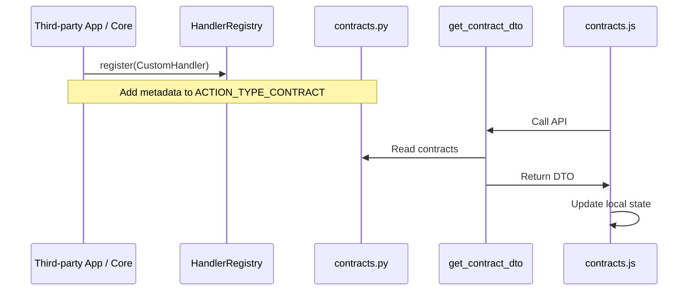
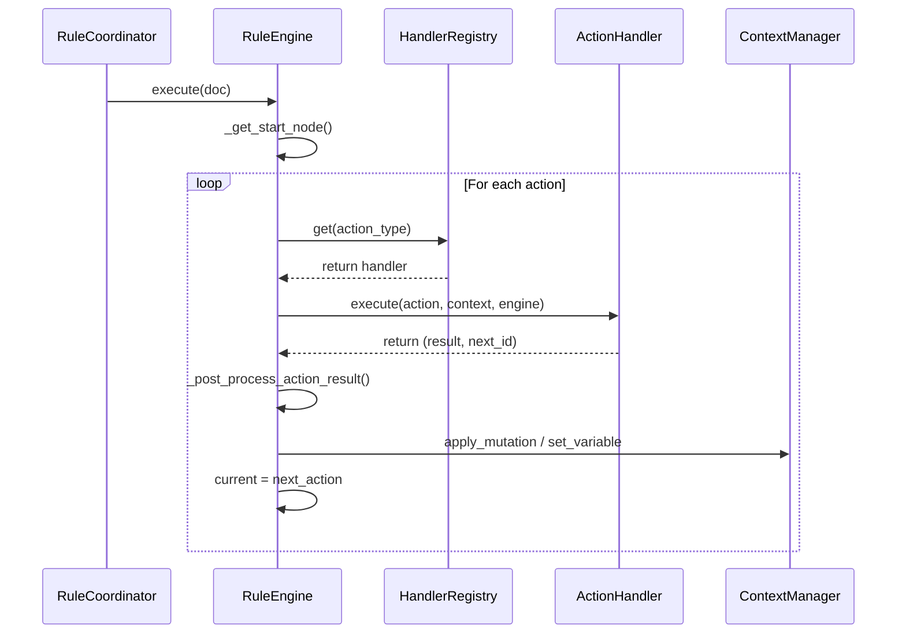

# FlexiRule New Action Type Analysis

## Executive Summary

This report provides a comprehensive architectural and implementation analysis of the current FlexiRule codebase with a focus on introducing new Action Types. FlexiRule utilizes a hybrid architecture where the backend (Frappe/Python) acts as the canonical source of truth for action contracts, while the frontend (Vue 3/VueFlow) provides a dynamic, metadata-driven builder experience.

The system is designed with extensibility in mind, using a Strategy pattern for backend action execution via `HandlerRegistry`. However, adding a new action type currently requires synchronized changes across several files in both the frontend and backend.

## Backend Architecture

### Action Handlers (`flexirule/ruleflow/core/action_handlers/`)
Action execution is decentralized into specialized handler classes inheriting from `ActionHandler`.
- **Purpose:** Decouples execution logic from the core engine.
- **Mechanism:** Strategy Pattern. Handlers register themselves with `HandlerRegistry`.
- **Key Files:**
  - `__init__.py`: Defines the base `ActionHandler` and `HandlerRegistry`.
  - `assignment.py`, `condition.py`, `process.py`, etc.: Individual handler implementations.

### Action Contracts (`flexirule/ruleflow/core/contracts.py`)
This file is the **Canonical Source of Truth** for what an action type is and how it should behave.
- **Metadata defined:**
  - `required_fields`: Mandatory fields for validation.
  - `has_next_true` / `has_next_false`: Flow control branching.
  - `terminal`: Ends the flow.
  - `css`: UI styling (icon, color).
  - `config_component`: The Vue component used for configuration.
  - `allowed_mutations` / `allowed_return_types`: Result handling policies.

### Validation Service (`flexirule/ruleflow/core/validation_service.py`)
Centralized validation logic that enforces contracts.
- **Modes:** `full` (activation), `draft` (saving), `node` (isolated config check).
- **Functionality:** Ensures required fields are present, validates JSON structures, and checks variable availability via graph traversal.

### Rule Engine (`flexirule/ruleflow/core/engine.py`)
The runtime execution environment.
- **Flow:** Traverses the action graph starting from `Entry Action`.
- **Execution:** Resolves the handler for the current `action_type` via `HandlerRegistry` and calls its `execute` method.
- **Post-processing:** Handles output mapping, variable assignment, and mutation modes after the handler returns.

## Frontend Architecture

### Rule Builder (`flexirule/public/js/flexirule/rule_builder/`)
A Vue 3 application integrated into Frappe Pages.
- **Canvas:** Uses `VueFlow` for graph visualization.
- **State Management:** Pinia stores (`useRuleStore`, `useGraphStore`, `useUIStore`).

### Component Mapping
Actions are rendered on the canvas using specific Vue components based on their `node_type` defined in the contract.
- **`ProcessNode.vue`**: Used by most standard actions (Assignment, Notify, Query Records, etc.).
- **`ConditionNode.vue`**, **`LoopNode.vue`**, etc.: Specialized nodes for control flow.

### Configuration System
When a node is opened for configuration, the `RuleConfigModal.vue` dynamically loads panels.
- **`ConfigurationPanel.vue`**: Acts as a dispatcher, loading the action-specific component (e.g., `AssignmentConfig.vue`) based on the `config_component` specified in the contract.

## Action Type Lifecycle

### 1. Registration
- **Backend:** Create a handler in `action_handlers/` and register it in `HandlerRegistry`. Update `contracts.py` with the action metadata.
- **Frontend:** `contracts.js` is automatically updated via `get_contract_dto` API, but specialized UI components must be manually created and registered.

### 2. Configuration
- User clicks a node on the canvas.
- `RuleConfigModal.vue` is displayed.
- The `config_component` defined in the contract is rendered inside the `ConfigurationPanel`.
- Changes are tracked in the `ruleStore` and marked as "dirty".

### 3. Validation
- **Frontend:** `validateAgainstContract` in `contracts.js` provides real-time feedback.
- **Backend:** `validation_service.py` performs rigorous checks during the save process or rule activation.

### 4. Persistence
- The rule is saved as a Frappe `Rule` document.
- Actions are stored in the `Rule Action` child table.
- Complex configurations are serialized into the `config` (JSON) or `visual_data` (JSON) fields.

### 5. Execution
- Trigger (e.g., DocType Event) initiates the `RuleCoordinator`.
- `RuleEngine` loads the action graph.
- For each step:
  1. Find handler via `HandlerRegistry`.
  2. Execute handler logic.
  3. `RuleEngine` post-processes results (mutations, variables).
  4. Move to `next_step_if_true/false`.

## Sequence Diagrams

### Action Registration & Discovery

### Action Execution Runtime

## Hidden Dependency Matrix

| Component | Depends On | Dependency Type | Risk Level | Impact of Change |
|-----------|------------|-----------------|------------|------------------|
| `RuleEngine` | `HandlerRegistry` | Direct | Low | Engine logic is stable. |
| `RuleEngine` | `contracts.py` (via helpers) | Metadata | Medium | Policy changes affect all actions. |
| `validation_service.py` | `HandlerRegistry` | Direct | Medium | Handlers must implement `validate` correctly. |
| `Rule Action` DocType | `action_type` Select options | Schema | High | Must keep DocType options in sync with code. |
| `contracts.js` | `get_contract_dto` API | Data | Medium | Outdated cache can cause UI/Validation mismatch. |
| `ConfigurationPanel.vue` | Global Component Registry | Runtime | High | Components must be registered in `globals.js`. |

## Change Surface Analysis

To introduce a completely new Action Type, the following files **must** be changed:

### Minimum Files (Required)
1. `flexirule/ruleflow/core/action_handlers/new_action.py`: Logic.
2. `flexirule/ruleflow/core/action_handlers/__init__.py`: Import/Register handler.
3. `flexirule/ruleflow/core/contracts.py`: Define metadata, fields, and policy.
4. `flexirule/ruleflow/doctype/rule_action/rule_action.json`: Add to `action_type` Select options.
5. `flexirule/public/js/flexirule/rule_builder/components/rule_config/types/NewActionConfig.vue`: UI.
6. `flexirule/public/js/flexirule/rule_builder/globals.js`: Register Vue component.

### Engineering Effort Estimate
- **Backend:** 2-4 hours (Handler, Contract, DocType update).
- **Frontend:** 4-12 hours (UI Component, complex logic).
- **Testing:** 2-4 hours.

### Regression Risk: Medium
Adding a new type is generally additive, but mistakes in `contracts.py` or the `Rule Action` DocType schema can impact validation of existing rules.
