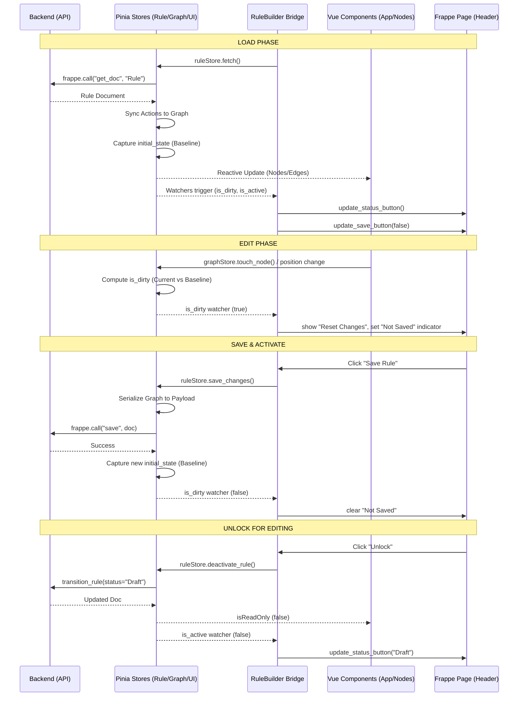

# Rule Builder Reactivity and State Audit Report (Refined)

## 1. State Lifecycle Diagram



---

## 2. Confirmed Root Causes with Code Evidence

### 2.1 Status Toggle Jitter
*   **File**: `flexirule/public/js/flexirule/rule_builder/rule_builder.js`
*   **Functions**: `setup_app()`, `toggle_rule_active()`
*   **Evidence**:
    *   Line 129: `watch(() => this.ruleStore.rule_doc?.is_active, ...)` calls `update_status_button`.
    *   Line 185: `toggle_rule_active()` explicitly calls `update_status_button` after API completion.
    *   Line 146: `$onAction("fetch")` also calls `update_status_button`.
*   **Root Cause**: Triple-path synchronization. The UI updates once reactively, once via the explicit call, and potentially a third time if a fetch is triggered.
*   **Reproduction**: Click "Set to Active". The button label may "flicker" or show the orange "Draft" badge momentarily before settling on green "Active".

### 2.2 Baseline Capture Timing (Dirty Lag)
*   **File**: `flexirule/public/js/flexirule/rule_builder/stores/useRuleStore.js`
*   **Function**: `fetch()`
*   **Evidence**:
    *   Line 191: `await nextTick(); initial_state.value = JSON.stringify(graphStore.getStateSnapshot());`
*   **Root Cause**: Capture happens after only one `nextTick`. Auto-layout and `fitView` (lines 181-186) involve timeouts and CSS transitions that settle *after* the baseline is already set.
*   **Reproduction**: Load a rule with auto-layout enabled. After 500ms, the rule shows "Not Saved" even though no user edits occurred.

### 2.3 Unused Baseline Sync
*   **File**: `flexirule/public/js/flexirule/rule_builder/stores/useRuleStore.js`
*   **Function**: `sync_initial_state_positions()`
*   **Evidence**: The function is defined (line 697) and exported, but it is **not** called by any store action after visual-only changes (like layout).
*   **Root Cause**: Logic exists but is orphaned, leaving layout operations in a "dirty" state.

---

## 3. Dirty State Analysis

### 3.1 Categorization
The current implementation (`useGraphStore.js:getStateSnapshot`) treats the graph as a flat list of objects.

| Change Type | Current Behavior | Target Behavior |
| :--- | :--- | :--- |
| **Semantic** (Add Node, Config Change) | Dirty (Detected in `data` key) | **Dirty** |
| **Connection** (Edges) | Dirty (Detected in `source/target`) | **Dirty** |
| **Visual** (Node Position) | Dirty (Detected in `position` key) | **Conditional Dirty** |

### 3.2 Verification
`getStateSnapshot` explicitly includes:
```javascript
position: {
    x: Math.round(el.position?.x || 0),
    y: Math.round(el.position?.y || 0),
}
```
This confirms that any dragging or auto-layout results in a "Dirty" state. Since RuleFlow persists positions in `visual_data`, this is technically correct but causes UX friction when auto-layout is forced on load.

---

## 4. Debug Simulation Architecture

### 4.1 Backend Readiness
`RuleEngine` (in `engine.py`) already supports executing in-memory documents:
```python
# engine.py:127
def __init__(self, rule_doc, execution_context=None):
    if isinstance(rule_doc, str):
        rule_doc = frappe.get_doc("Rule", rule_doc)
    self.rule = rule_doc # This accepts a Doc object!
```
The backend `test_rule` API (api.py) currently only takes a `rule_name`.

### 4.2 Payload Reusability
The `save_changes` function in `useRuleStore.js` contains a large block (lines 271-460) that transforms the graph into a Rule-compatible JSON object. This logic should be extracted into a `generateRuleDoc()` helper.

---

## 5. Refined Recommendations

1.  **Single Source of Truth**:
    *   Deprecate manual button updates in `rule_builder.js`.
    *   The `RuleBuilder` class should only initialize the app. The header buttons should be managed by standard Vue reactivity or a single, unified watcher on a `headerState` computed property.
2.  **Snapshot Separation**:
    *   Split `initial_state` into `initial_semantic_state` and `initial_visual_state`.
    *   Allow "Visual-only Dirty" to be treated as a warning or a silent auto-save, while "Semantic Dirty" blocks activation.
3.  **Simulation API**:
    *   Modify `test_rule` to accept `rule_doc_json`.
    *   If present, the API should do: `rule = frappe.get_doc(json.loads(rule_doc_json))` instead of database lookup.
