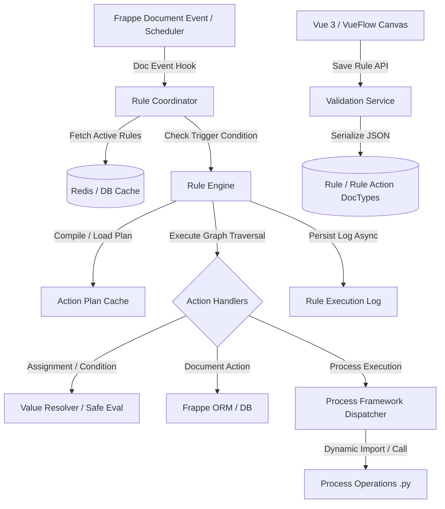

# Architecture Audit — FlexiRule

## 1. System Architecture Reconstruction

FlexiRule is structured as a dual-layer application within the Frappe Framework ecosystem:
1. **Frontend**: Vue 3 Single-Page Visual Rule Builder utilizing VueFlow, Pinia stores, custom node controls, and TipTap text generator editors embedded inside a Frappe Desk page (`rule_builder`).
2. **Backend**: Python-based rule compilation and execution engine, document hook listeners (`flexirule.ruleflow.hooks.execute_rules`), background scheduler, and a modular Process plugin framework.

---

## 2. Structural & Architectural Relationships

### 2.1 Visual Canvas vs. Backend Execution Runtime
The visual canvas representation (`visual_data` JSON containing nodes and edges) and the executable backend representation (`actions` child table records on `Rule`) maintain a dual-state mapping:
- **Frontend Representation**: VueFlow graph nodes (`type: "start"`, `"selector"`, `"configurable"`, `"transform"`) with layout coordinates (`x, y`) and edges connecting source handles (`"true"`, `"false"`, `"default"`) to target handles.
- **Backend Representation**: Sequential `Rule Action` child rows linked via `next_step_if_true` and `next_step_if_false` fields.
- **Compilation & Topological Sort**: During `RuleStore.save_changes()`, `getTopologicalSort()` orders the canvas nodes and serializes them into `Rule Action` rows, re-assigning `idx` and computing `next_step` IDs.

---

## 3. Key Inconsistencies & Contract Drift

### 3.1 ID Mapping Drift (Canvas Node ID vs. Action ID)
- **Finding**: VueFlow generates temporary UUID node IDs (e.g., `node_123456789`), whereas backend action handlers use `action_id` (e.g., `act_01`).
- **Risk**: During deserialization in `useGraphStore.js:sync_actions_to_graph()`, if `action_id` is missing or mismatched with `name`, edges link to orphan node IDs, causing canvas edges to disappear on refresh while remaining connected in the database.

### 3.2 Contract Property Misalignment
- **Finding**: Frontend contracts defined in `flexirule/public/js/flexirule/core/contracts.js` do not enforce `ignore_permissions` audit reasons (`permission_audit_reason`) required by backend validation in `permissions.py:can_ignore_permissions()`.
- **Impact**: Users configuring actions with `ignore_permissions=1` via the UI receive unhandled backend validation exceptions upon rule save.

### 3.3 Dirty State Tracking Interference
- **Finding**: `useCanvasLayout.js` automatically triggers layout adjustments on initial render if aspect ratios or stored preferences mismatch default settings.
- **Impact**: Mounting a node modal or rendering a graph automatically sets `useRuleStore.is_dirty = true`, prompting users with false "Unsaved Changes" warnings when navigating away without making edits.

---

## 4. Architectural Weaknesses & Risks

1. **Dual Caching Layer Complexity (`action_plan_cache.py` vs `RuleCoordinator._rule_cache`)**:
   Rule execution relies on two distinct caching layers:
   - Request-local memory cache (`frappe.local.flexirule_rule_cache`).
   - Redis cache for action plans (`flexirule_action_plan_v1`).
   When rules are modified in multi-worker environments, invalidation hooks in `hooks.py` clear local memory but fail to purge Redis key patterns consistently across Redis cluster topologies due to restrictive `frappe.cache.delete_keys` usage.

2. **Process Plugin Boundary Leakage**:
   Process operations are loaded dynamically using `frappe.get_attr(method_path)` in `process_runtime_v2.py`. While `check_method_permission` checks namespace prefixes, custom Process Operations that do not declare `requires_doc` or `writes_to` metadata bypass runtime contract enforcement, allowing unmonitored database writes inside read-only triggers.
