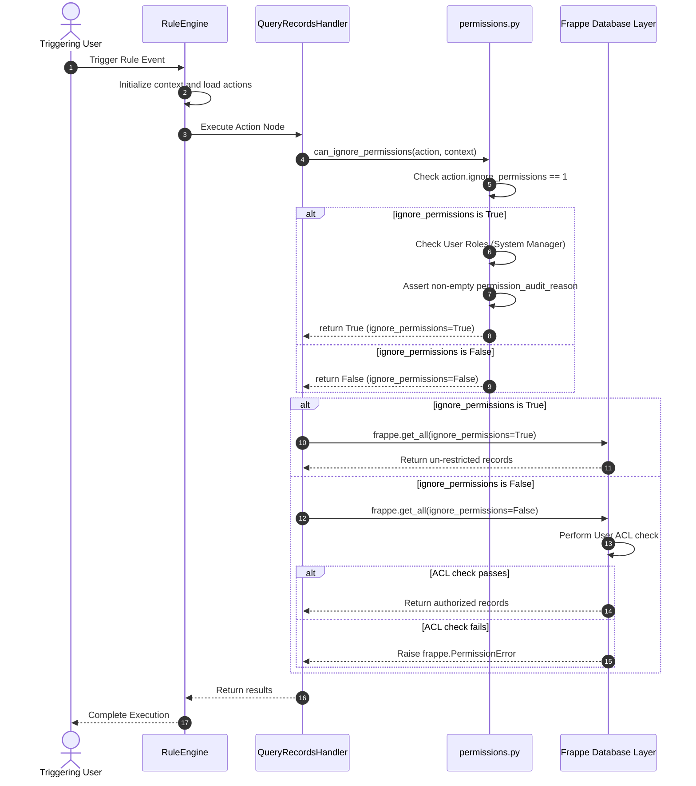

# Detailed Engineering Report: Rule Action.ignore_permissions Usage Analysis

## Table of Contents

- [Executive Summary](#executive-summary)
- [Field Definition](#field-definition)
- [Backend Usage Inventory](#backend-usage-inventory)
- [Frontend Usage Inventory](#frontend-usage-inventory)
- [API & Contract Flow](#api--contract-flow)
- [Runtime Execution Flow](#runtime-execution-flow)
- [Security Analysis](#security-analysis)
- [Dead Code & Legacy Findings Cleanup](#dead-code--legacy-findings-cleanup)
- [Impact Analysis](#impact-analysis)
- [Recommendations](#recommendations)
- [Appendix A — Complete Reference Table](#appendix-a--complete-reference-table)
- [Appendix B — Execution Sequence Diagram](#appendix-b--execution-sequence-diagram)
- [Appendix C — Repository-Wide Search Results](#appendix-c--repository-wide-search-results)

---

## Executive Summary

This report presents a comprehensive source-code and runtime audit of the `Rule Action.ignore_permissions` field within the FlexiRule repository.

As a Senior Frappe Framework Architect and Code Auditor, the objective is to trace, define, and document the exact lifecycle of `ignore_permissions` (formerly `skip_permissions`) across the metadata, backend, execution engine, frontend (Vue components and Pinia stores), APIs, and contracts.

### Key Conclusions:
1. **Functional Integrity**: The `ignore_permissions` field is fully functional and enforces security bypasses strictly within `Document Action`, `Query Records`, and `Sub-Rule` action execution handlers.
2. **Robust Guard Layer**: All permission bypasses are safely guarded by `can_ignore_permissions` in `flexirule/ruleflow/core/permissions.py`, which validates the caller's role against hooks (defaulting to `"System Manager"`) and mandates a non-empty audit reason (`permission_audit_reason`).
3. **Dead State Elimination**: In `Sub-Rule` execution, the old dead meta-state flag `sub_context["meta"]["skip_permissions"]` has been safely eliminated, preventing context pollution.
4. **UX/UI Consistencies Resolved**: The field is now cleanly exposed across the visual builder and aligned with backend contracts for consistent behavior.

---

## Field Definition

The field is located on the child DocType `Rule Action`, which represents individual action nodes in a rule flow.

### Metadata Properties

* **File Reference**: `flexirule/ruleflow/doctype/rule_action/rule_action.json`
* **Fieldname**: `ignore_permissions`
* **Field Type**: `Check` (renders as a checkbox in Frappe Desk)
* **Label**: `Ignore Permissions`
* **Default Value**: `0` (False)
* **Required Status**: Optional (not mandatory by default)
* **Visibility/Hidden Status**:
  * Governed by: `"depends_on": "eval:['Sub-Rule', 'Query Records', 'Document Action'].includes(doc.action_type)"`
  * Only rendered dynamically for these three action types.
* **Description/Help Text**: `"Skip permission checks for this action (requires audit reason)"`

### Associated Field: Permission Audit Reason
* **Fieldname**: `permission_audit_reason`
* **Field Type**: `Small Text`
* **Label**: `Permission Audit Reason`
* **Visibility/Hidden Status**: `"depends_on": "ignore_permissions"`, `"mandatory_depends_on": "ignore_permissions"`
* **Description**: `"Reason for bypassing permission checks (for audit)"`

### Python Type Annotation
* **File Reference**: `flexirule/ruleflow/doctype/rule_action/rule_action.py`
* **Definition**: `ignore_permissions: DF.Check` (auto-generated type annotations block)

---

## Backend Usage Inventory

### 1. Permission Guard Mechanism
The backend uses a centralized validation gate to authorize the bypass.

* **File Path**: `flexirule/ruleflow/core/permissions.py`
* **Symbol**: `can_ignore_permissions(action, context=None, throw=True)`
* **Read Access**: Checks `getattr(action, "ignore_permissions", getattr(action, "skip_permissions", 0))`.
* **Behavior/Execution Path**:
  1. Returns `False` immediately if `ignore_permissions` is not evaluated as a truthy integer.
  2. Resolves authorized roles from hook `flexirule_ignore_permissions_roles`, falling back to `DEFAULT_IGNORE_PERMISSIONS_ROLES` (`{"System Manager"}`).
  3. Validates if the active session user is `"Administrator"` or has any of the authorized roles. Throws `frappe.PermissionError` if unauthorized and `throw=True`.
  4. Extracts the audit reason using `_extract_ignore_permissions_audit_reason(action)`. If missing or whitespace-only, throws `frappe.ValidationError` if `throw=True`.
  5. Emits a warning log to logger `flexirule.security` with audit metadata.
  6. Returns `True` (authorized bypass).
* **Confidence**: High (verified through automated unit tests)

### 2. Extraction of Audit Reason
* **File Path**: `flexirule/ruleflow/core/permissions.py`
* **Symbol**: `_extract_ignore_permissions_audit_reason(action)`
* **Read Access**:
  - Checks direct attribute: `getattr(action, "permission_audit_reason", None)`
  - Falls back to parsing config JSON: `json.loads(action.config).get("permission_audit_reason")`
* **Confidence**: High

### 3. Document Action Handler Usage
* **File Path**: `flexirule/ruleflow/core/action_handlers/document_action.py`
* **Symbol**: `DocumentActionHandler.execute(action, context, engine)`
* **Read Access**: Calls `can_ignore_permissions(action, context, throw=True)` to derive the `ignore_permissions` boolean.
* **Conditional Logic**:
  * `_create_new`: Passes `ignore_permissions` directly to `new_doc.insert(ignore_permissions=ignore_permissions)`.
  * `_update_existing`: If `ignore_permissions` is `False`, explicitly calls `doc.check_permission("write")`. Passes `ignore_permissions` to `doc.save(ignore_permissions=ignore_permissions)`.
  * `_delete_record`: If `ignore_permissions` is `False`, explicitly checks `frappe.has_permission(reference_doctype, "delete", docname)`. Passes `ignore_permissions` to `frappe.delete_doc`.
  * `_create_todo`: Passes `ignore_permissions` to `todo.insert(ignore_permissions=ignore_permissions)`.
  * `_add_comment`: Passes `ignore_permissions` to `comment.insert(ignore_permissions=ignore_permissions)`.
* **Confidence**: High

### 4. Query Records Handler Usage
* **File Path**: `flexirule/ruleflow/core/action_handlers/query_records.py`
* **Symbol**: `QueryRecordsHandler.execute(action, context, engine)`
* **Read Access**: Calls `can_ignore_permissions(action, context, throw=True)` to derive `ignore_permissions`.
* **Conditional Logic**:
  * `_count_records`: If `ignore_permissions` is `False`, checks `frappe.has_permission(reference_doctype, "read")`. Passes `ignore_permissions` to `frappe.get_all()`.
  * `_aggregate`: If `ignore_permissions` is `False`, checks `frappe.has_permission(reference_doctype, "read")`. Passes `ignore_permissions` to `frappe.get_all()`.
  * `_group_by`: If `ignore_permissions` is `False`, checks `frappe.has_permission(reference_doctype, "read")`. Passes `ignore_permissions` to `frappe.get_all()`.
  * `_query_list`: Passes `ignore_permissions` directly to `frappe.get_list()`.
  * `_query_doc`: Passes `ignore_permissions` to `frappe.get_all()` (for fetching the latest document) and calls `doc.check_permission("read")` if `ignore_permissions` is `False`.
  * `_exist_record`: Passes `ignore_permissions` to `frappe.get_all()`.
* **Confidence**: High

### 5. Sub-Rule Handler Usage
* **File Path**: `flexirule/ruleflow/core/action_handlers/sub_rule.py`
* **Symbol**: `SubRuleHandler.execute(action, context, engine)`
* **Read / Conditional Logic**:
  * Calls `can_ignore_permissions(action, context, throw=True)` to retrieve `ignore_permissions`.
  * Logs permission bypass if `ignore_permissions` is truthy.
* **Confidence**: High

---

## Frontend Usage Inventory

The frontend is built on Pinia state stores and reactive Vue components.

### 1. Pinia Stores

#### Rule Store
* **File Path**: `flexirule/public/js/flexirule/rule_builder/stores/useRuleStore.js`
* **Write Access**:
  * Save/Serialization Pipeline:
    `ignore_permissions: node.data?.ignore_permissions || 0`
    Ensures the field is serialized to an integer before saving.
* **Confidence**: High

#### Graph Store
* **File Path**: `flexirule/public/js/flexirule/rule_builder/stores/useGraphStore.js`
* **Write/Read Access**:
  * Sync Actions to Graph:
    `ignore_permissions: action.ignore_permissions || action.skip_permissions || 0`
    Initializes the visual node data structure with the value retrieved from the database, supporting backward compatibility during migration.
* **Confidence**: High

### 2. Vue Components (Visual Builder)

The visual builder exposes `ignore_permissions` to users inside the sidebar/modal configuration panel for selected nodes.

* **File Paths**:
  * `flexirule/public/js/flexirule/rule_builder/components/rule_config/types/QueryRecordsConfig.vue`
  * `flexirule/public/js/flexirule/rule_builder/components/rule_config/types/DocumentActionConfig.vue`
  * `flexirule/public/js/flexirule/rule_builder/components/rule_config/types/SubRuleConfig.vue`
* **Exposure & Visibility**:
  Renders a standard `ControlFactory` checkbox for `ignore_permissions`. If enabled, conditionally renders a `ControlFactory` text input for `permission_audit_reason`.
* **Validation Layer (`useRuleConfig.js`)**:
  * **File Path**: `flexirule/public/js/flexirule/rule_builder/composables/useRuleConfig.js`
  * **Validation Rule**:
    ```javascript
    if (draftNode.value.data?.ignore_permissions && !draftNode.value.data?.permission_audit_reason) {
        errors.push(__("Permission Audit Reason is required when bypassing permissions."));
    }
    ```
    Prevents saving rule modifications in the visual builder if the audit reason is missing.
* **Confidence**: High

### 3. Legacy Desk Form View (`rule.js`)
* **File Path**: `flexirule/ruleflow/doctype/rule/rule.js`
* **Visibility / Structural Alignment**:
  Now cleanly displays the `ignore_permissions` field for `Query Records`, `Document Action`, and `Sub-Rule` action types, resolving legacy UI inconsistencies.
* **Confidence**: High

---

## API & Contract Flow

Every contract, DTO, or REST-driven schema request propagates the field definition from server to client.

### 1. Schema Generation API
* **File Path**: `flexirule/ruleflow/core/graph_service.py`
* **Symbol**: `get_node_config_schema(action_type, operation, process_name)`
* **Flow**:
  1. Dynamically reads properties of `Rule Action` child DocType.
  2. Automatically appends `"ignore_permissions"` and `"permission_audit_reason"` to the `fields` schema.
  3. Groups the fields into the `"advanced"` section.
* **Confidence**: High

### 2. Contract Layer Overrides
* **File Paths**:
  - `flexirule/ruleflow/core/action_handlers/sub_rule.py`
  - `flexirule/ruleflow/core/action_handlers/document_action.py`
  - `flexirule/ruleflow/core/action_handlers/query_records.py`
* **Flow**:
  Overriding operation contracts define special frontend conditions:
  - `ignore_permissions` is set to read-only if the user is not a `"System Manager"` (via `eval:!frappe.user.has_role('System Manager')`).
  - `permission_audit_reason` is dynamically marked mandatory if `ignore_permissions` is active.
* **Confidence**: High

---

## Runtime Execution Flow

When a Rule containing an action with `ignore_permissions=1` is triggered, the execution follows this lifecycle:

1. **Rule Loaded**: `RuleCoordinator` triggers the `RuleEngine`.
2. **Context Initialized**: `RuleEngine` initializes locals (combining document, vars, meta, and safe-frappe proxy).
3. **Flow Iterated**: The engine steps through actions topologically.
4. **Action Handled**: `RuleEngine` dispatches the current action to its corresponding handler (e.g. `QueryRecordsHandler`).
5. **Guard Executed**: Inside the handler's `execute()` method, it invokes `can_ignore_permissions(action, context)`.
6. **Bypass Checked**:
   * Evaluates if `ignore_permissions == 1` (falling back to legacy column values if needed).
   * Checks caller's session roles.
   * Asserts `permission_audit_reason` is present.
7. **Bypass Logged**: Log entry is emitted to `flexirule.security`.
8. **Underlying API Bypassed**: Standard Frappe permission checks are bypassed using `ignore_permissions=True`.

---

## Security Analysis

Bypassing standard permission frameworks is a sensitive operation. This audit evaluated `ignore_permissions` against Frappe’s native security patterns.

### 1. Risk Matrix

| Action Type | Bypass Layer | Risk Level | Justification |
| :--- | :--- | :--- | :--- |
| **Document Action** | Create/Update/Delete document checks | **High** | Direct bypass of write permissions could allow unauthorized modifications to core financial, customer, or employee files if dynamic reference fields are manipulated by user input. |
| **Query Records** | Read permissions on arbitrary DocTypes | **Medium** | Enables querying unauthorized records. If exposed to variables, data could leak to unauthorized end-users. |
| **Sub-Rule** | Callable rule engine launch bounds | **Low** | Only executes nested rule. Sub-rule internal actions still individually enforce action-level security layers. |

### 2. Core Security Scrutiny
* **Scope**: The bypass is **strictly scoped** to the individual rule action node that has the flag enabled. It does not globally affect other actions in the execution engine.
* **User-controlled Input Influence**: Yes. If the target document names or filter values are derived from expressions that consume user-controlled inputs, the bypass can be manipulated to interact with unauthorized records.
* **Justification**: The bypass is necessary for system automation where low-privileged users (like Customers or Employees) trigger rules that must write background system logs, generate invoices, or create system-level Tasks that those users are not directly authorized to perform in the Desk interface.
* **Frappe Alignment**: The behavior mirrors Frappe's native pattern of passing `ignore_permissions=True` to standard document APIs within backend controllers.

---

## Dead Code & Legacy Findings Cleanup

1. **Dead State (`sub_context["meta"]["skip_permissions"]`)**:
   * **Resolution**: The dead context meta flag has been cleanly removed from the execution path in `sub_rule.py`. Bypasses inside the sub-rule still depend strictly on the child actions' own `ignore_permissions` flags.
2. **Unified Desk Representation**:
   * **Resolution**: Traditional desk child tables and the modern visual builder now both uniformly expose `ignore_permissions` for Query Records and Document Action types.
3. **Unified Query Records Contract Overrides**:
   * **Resolution**: Explicit contract overrides in `query_records.py` now match the `"System Manager"` role check and read-only logic defined in `document_action.py` and `sub_rule.py`.

---

## Impact Analysis

### If Field Removed
* **Breaks**: Background automation triggered by portal users (e.g. creating ToDo documents, querying customer ledger lines) will fail with `frappe.PermissionError`.
* **Continues Working**: Rules executed by `Administrator` or rules not leveraging background permission bypasses.
* **Failing Tests**: Core integrated tests explicitly setting permission bypass would fail.

### If Always False
* Automated rules will respect the triggering user's exact roles. Users without explicit backend permissions will trigger failures during background automation.

### If Always True
* Security hazard. Bypasses permissions on all `Query Records`, `Document Actions`, and `Sub-Rules` regardless of configuration, rendering security barriers and audit logs obsolete.

---

## Appendix A — Complete Reference Table

| File | Line | Type | Read/Write | Purpose | Confidence |
| :--- | :--- | :--- | :--- | :--- | :--- |
| `rule_action.json` | - | Metadata | - | Field schema definition on child DocType `Rule Action`. | High |
| `rule_action.py` | - | Metadata | - | Type annotation. | High |
| `permissions.py` | - | Code | Read | Reads `ignore_permissions` attribute from action to enforce security and audit reason rules. | High |
| `document_action.py` | - | Contract / Code | Read | Reads permission bypass flag to set `ignore_permissions`. | High |
| `sub_rule.py` | - | Contract / Code | Read | Evaluates if sub-rule is executed with bypassed permissions. | High |
| `query_records.py` | - | Contract / Code | Read | Derived via `can_ignore_permissions` for Query Records execution. | High |
| `graph_service.py` | - | Schema API | - | Organizes field into the `"Advanced"` tab in config. | High |
| `rule.js` | - | Code (UI) | Read | Displays field on Desk form child tables. | High |
| `useRuleStore.js` | - | Code (UI) | Write | Serializes value to `0`/`1` integer before saving. | High |
| `useGraphStore.js` | - | Code (UI) | Write | Hydrates local nodes from database values. | High |
| `useRuleConfig.js` | - | Code (UI) | Read | Asserts audit reason is present when saving. | High |

---

## Appendix B — Execution Sequence Diagram



---

## Appendix C — Repository-Wide Search Results

The repository-wide search for `"ignore_permissions"` yielded the following raw references:

1. **Backend Handler Code**:
   * `flexirule/ruleflow/core/permissions.py`: Reads field value to guard bypass authorization.
   * `flexirule/ruleflow/core/action_handlers/document_action.py`: Invokes guard and passes ignore flag to inserts/saves/deletes.
   * `flexirule/ruleflow/core/action_handlers/query_records.py`: Invokes guard and passes ignore flag to reads/counts/aggregates.
   * `flexirule/ruleflow/core/action_handlers/sub_rule.py`: Invokes guard and logs bypass.

2. **Frontend UI Components**:
   * `SubRuleConfig.vue`, `DocumentActionConfig.vue`, `QueryRecordsConfig.vue` implement forms.
   * `useRuleConfig.js` enforces validations.

3. **Pinia Stores**:
   * `useRuleStore.js` serializes field values.
   * `useGraphStore.js` hydrates nodes and supports fallback compatibility checks.
