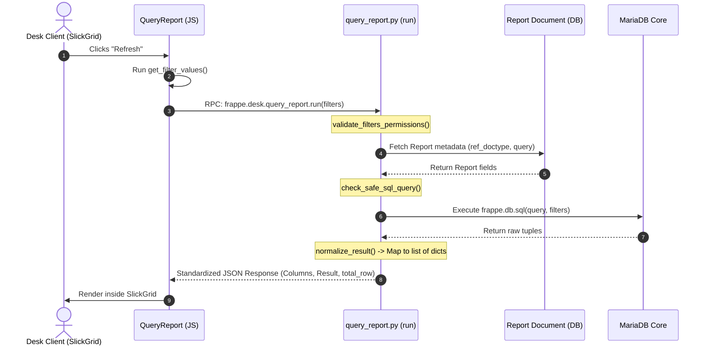
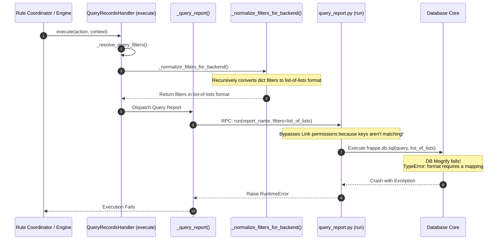

# Deep Architecture Audit: Frappe Report API vs FlexiRule Query Report
**Author:** Senior Frappe Framework Architect & Code Auditor
**Date:** March 2026
**Status:** Completed

---

## 1. Executive Summary

This architecture audit provides a deep, evidence-based analysis of the **Frappe Framework (v15+)** Report system and compares it to **FlexiRule's Query Report** implementation within the `Query Records` action subsystem.

Based on static code analysis of the canonical Frappe Framework code (`/home/jules/frappe-bench/apps/frappe`) and runtime verification, the audit traces how report filters are defined, validated, processed, and bound to SQL queries, and analyzes how reports are executed and their results returned to the desk client.

### Key Architectural Findings:
1. **Filter Format Mismatch & SQL Failure:**
   Native Frappe Query Reports expect a flat key-value dictionary (e.g., `{"company": "My Company"}`) for SQL parameter binding using Python's mapping format (e.g., `%(company)s`).
   FlexiRule's `QueryRecordsHandler` relies on a shared `_resolve_query_filters` utility that aggressively normalizes all query filters into a list-of-lists format (e.g., `[["company", "=", "My Company"]]`).
   When passed to `frappe.desk.query_report.run`, this list-of-lists structure bypasses Frappe's Link-level validation checks and triggers a database-level crash (`TypeError: format requires a mapping`) upon query execution.

2. **Redundant Result Normalization:**
   `QueryRecordsHandler._query_report` implements custom logic to extract column fieldnames and map positional result lists into list-of-dicts structures.
   This custom logic duplicates Frappe's native `normalize_result` function inside `frappe.desk.query_report.generate_report_result`, which already transforms raw database outputs into standard lists of dictionaries mapped to fieldnames.

3. **Untested and Partially Aligned Implementation:**
   The FlexiRule backend test suite contains zero test cases covering `Query Report` execution mode, leaving filter conversion bugs undetected. Additionally, while the UI supports a "Skip Permissions" toggle, the backend's delegation to `frappe.desk.query_report.run` does not support permission bypassing, resulting in hardcoded permission checks being enforced regardless of rule configuration.

### Summary of Recommendations:
To achieve full framework alignment and resolve runtime failures, FlexiRule must:
- Implement a dedicated non-normalizing filter resolution path for the `Query Report` mode that preserves flat dictionaries.
- Delegate result normalization entirely to the Frappe Report API, removing custom extraction boilerplate.
- Introduce robust activation-time validation to verify Report existence in `QueryRecordsHandler.validate`.
- Augment the test catalog with comprehensive Query Report integration tests.

---

## 2. Frappe Report Architecture

The complete execution lifecycle of a Frappe Report spans from a client-side user request in the browser to the execution of raw database queries and returning a standardized JSON payload.

### Step-by-Step Execution Lifecycle

```
Browser (frappe.views.QueryReport)
       ↓ (Triggers refresh/run)
JS: frappe.call({ method: "frappe.desk.query_report.run", args: { ... } })
       ↓ (Network Request via REST/RPC)
Python: frappe.desk.query_report.run(...) [Whitelisted]
       ↓
1. Permissions Validation (validate_filters_permissions & has_permission)
       ↓
2. Document Extraction (get_report_doc)
       ↓
3. Result Generation (generate_report_result)
       ↓
4. Report Type Dispatcher (get_report_result)
       ├──> [Query Report] -> Report.execute_query_report(filters)
       │                        └─> check_safe_sql_query & frappe.db.sql
       └──> [Script Report] -> Report.execute_script_report(filters)
                                └─> execute_module / execute_script
       ↓
5. Post-Processing & Normalization (normalize_result, add_total_row)
       ↓
JSON Response -> Browser (Rendered via SlickGrid)
```

1. **Client Initiation:**
   The user opens a Report page in the browser (driven by `QueryReport` in `query_report.js`). Upon clicking "Refresh", `refresh()` collects filters using `get_filter_values(raise=true)` and issues a whitelisted RPC request to the backend.
2. **Whitelisted Entry Point:**
   `frappe.desk.query_report.run` receives the request. It extracts filters, validates filter permissions via `validate_filters_permissions`, and checks DocType level permissions using `frappe.has_permission(report.ref_doctype, "report")`.
3. **Execution Dispatch:**
   The execution is handed over to `generate_report_result` which calls `get_report_result`. Depending on the `Report.report_type` property, execution is routed:
   - **Query Report:** Executes `Report.execute_query_report` where SQL is loaded, checked for safety via `check_safe_sql_query`, and run through `frappe.db.sql(self.query, filters)`.
   - **Script Report:** Executes `Report.execute_script_report` which invokes the report's associated Python module's `.execute(filters)` function.
4. **Data Normalization:**
   The raw database cursor output (tuples or list of lists) is converted to a list of dicts via `normalize_result` using column fieldnames. Total rows, formatting metadata, and custom buttons are injected before serializing into a standard JSON response.

---

## 3. Frontend Filter Lifecycle

### Filter Metadata & Lifecycle
Report filters are defined inside a report's associated client-side JavaScript file (`{report_name}.js`) inside the `frappe.query_reports["{Report Name}"]` object under the `filters` key, or fallback to filters defined in the `Report` document.

- **Filter Initialization:** In `query_report.js`, `get_report_settings()` evaluates the script. The `setup_filters()` method then iterates over settings filters, adding them as UI fields via `this.page.add_field(df, filter_area)`.
- **Default Values:** Implemented via `df.default`. If defined, `setup_filters()` sets the initial input: `f.set_input(df.default)`.
- **Mandatory Filters:** Implemented using `df.reqd` or `df.mandatory`. The `get_filter_values(raise)` method checks mandatory fields. If any are missing, it stops execution, hides the loading animation, displays an alert, and raises `"Filter missing"`.
- **Filter Dependencies:** Handled by `refresh_filters_dependency()` which triggers on every filter change. `evaluate_depends_on_value` runs the `df.depends_on` expression against current filter values via `frappe.utils.eval`. If evaluated as false, the dependent filter is hidden and its value is cleared.

### Filter Input Control Types
- **Link Filters (`Link`):** Uses standard `frappe.ui.form.LinkGetter` to perform dynamic auto-completion.
- **Date Filters (`Date` / `DateRange`):** Date types use the datepicker UI. `DateRange` provides an array `[start_date, end_date]`.
- **MultiSelect Filters (`MultiSelectList`):** Collects multiple options as an array of values, serialized as a JSON string when sent over network.
- **Table MultiSelect (`Table MultiSelect`):** Renders table child records for selection, mapping them into standard database search constraints.

### Client Payload Structure
When initiating a report, the browser constructs a `GET` request to `frappe.desk.query_report.run` with the following schema:

```json
{
  "report_name": "ToDo",
  "filters": {
    "status": "Open",
    "priority": "High",
    "owner": "admin@example.com",
    "date_range": ["2026-01-01", "2026-12-31"]
  },
  "ignore_prepared_report": false,
  "is_tree": false,
  "parent_field": null,
  "are_default_filters": false
}
```

---

## 4. Backend Execution Lifecycle

The main backend entry points are situated in `frappe/desk/query_report.py`.

### Point Methods

#### 1. `frappe.desk.query_report.get_script(report_name)`
* **Purpose:** Loads the controller script (JavaScript) and HTML templates associated with a standard or custom report.
* **Parameters:** `report_name` (str)
* **Validation:** Checks if the report document exists and is accessible.
* **Returned Value:** Dictionary containing `script` (raw JS code), `html_format` (raw printing template), and `execution_time`.

#### 2. `frappe.desk.query_report.run(...)`
* **Purpose:** Core execution gateway for running a report.
* **Parameters:**
  - `report_name` (str): Name of the target report.
  - `filters` (dict/str, optional): Key-value filters.
  - `user` (str, optional): Executing user (defaults to current session user).
  - `ignore_prepared_report` (bool, optional): Force bypass of background prepared cache.
  - `custom_columns` (list, optional): Columns customized via user views.
  - `is_tree` (bool, optional): Indication to preserve hierarchical parent-child format.
  - `parent_field` (str, optional): Target field for recursive tree formatting.
  - `are_default_filters` (bool, optional): Injects default saved report filters if true.
* **Validation:**
  - Validates read permissions on `Report` and executing permissions on reference DocType (`ref_doctype`).
  - Calls `validate_filters_permissions(report_name, filters, user)`.
* **Returned Value:**
  - Dictionary with keys: `result` (list of dicts), `columns` (list of dicts), `message` (HTML), `chart` (dict), `report_summary` (list), `skip_total_row` (bool), `execution_time` (float).

#### 3. `frappe.desk.query_report.export_query()`
* **Purpose:** Exports report results to download formats (CSV/Excel).
* **Parameters:** Receives data via request parameters (`report_name`, `filters`, `file_format_type`).
* **Validation:** Performs standard report execution permissions checks.
* **Returned Value:** Serves raw binary stream of the generated file.

#### 4. `frappe.desk.query_report.save_report(...)`
* **Purpose:** Saves custom column configurations or default filter overrides for reports.
* **Parameters:** `reference_report` (str), `report_name` (str), `columns` (str/json), `filters` (str/json).
* **Validation:** Asserts user has System Manager or Report Manager role.
* **Returned Value:** Returns the newly saved `Report` DocType document name.

---

## 5. Filter Validation

Frappe enforces a series of strict security and integrity checks on report filters and overall configuration prior to executing any queries.

| Validation Type | Source File | Function | Exception Raised | Execution Path |
| :--- | :--- | :--- | :--- | :--- |
| **Missing Filters** | `query_report.js` | `get_filter_values` | Throw string `"Filter missing"` | Triggered in frontend prior to dispatching RPC network call. Stops execution. |
| **Link Filter Access Checks** | `query_report.py` | `validate_filters_permissions` | `frappe.PermissionError` (via `frappe.throw`) | Validates each `Link` filter value. Throws if executing user lacks `read` or `select` permissions on the target document. |
| **DocType Level Permissions** | `query_report.py` | `run` | `frappe.PermissionError` | Asserts that user has report-level access to report's `ref_doctype` via `frappe.has_permission(report.ref_doctype, "report")`. |
| **SQL Injection Safety** | `frappe/database/utils.py` | `check_safe_sql_query` | `frappe.ValidationError` | Scans Query Reports' raw SQL string for dangerous syntax (`drop`, `delete`, `update`, `alter`, etc.). |
| **Format Validation** | `query_report.py` | `run` | `TypeError` / `ValueError` | Checks mapping structure of filters when deserialized via `json.loads`. |

---

## 6. Query Report Internals

### SQL Storage & Compilation
Query Reports utilize raw SQL queries stored in the database in the `query` field of the `Report` document. Standard (out-of-the-box) Query Reports can be shipped with raw SQL statements.

### Parameter Binding Strategy
Frappe uses Python DB-API dictionary-style parameter binding. The raw SQL query contains placeholders in the format `%(fieldname)s`.

#### Injection Prevention & Mogrify:
When `frappe.db.sql(self.query, filters)` is invoked, the database engine (MariaDB/PostgreSQL connector) dynamically escapes and safely interpolates the values into the placeholder locations. Under no circumstances should string concatenation or raw string formatting (`%` or `.format()`) be used to construct SQL within reports.

```python
# Execution inside Report.execute_query_report (frappe/core/doctype/report/report.py)
check_safe_sql_query(self.query)
result = [list(t) for t in frappe.db.sql(self.query, filters)]
```

If `filters` is passed as a list of lists or in an invalid format, pymysql will fail to bind parameters, raising `TypeError: format requires a mapping` and halting database execution.

---

## 7. Script Report Internals

Script Reports differ from Query Reports in execution because they run arbitrary Python code rather than storing SQL strings in the database.

### Storage & Module Resolution
1. **Standard Script Reports:** Stored on disk in Python files within the app structure.
   - Dotted path resolution: Derived in `Report.execute_module` using the Report's module and name:
     `method_name = get_report_module_dotted_path(module, self.name) + ".execute"`
2. **User-Created (Custom) Script Reports:** Stored in the database inside the `report_script` field of the `Report` document. These are evaluated using Python's `exec` inside a sandbox environment (via `Report.execute_script`).

### Execution Divergence Path
The execution path splits inside `frappe.desk.query_report.get_report_result`:

```python
def get_report_result(report, filters):
	res = None
	if report.report_type == "Query Report":
		res = report.execute_query_report(filters) # DB SQL Execution
	elif report.report_type == "Script Report":
		res = report.execute_script_report(filters) # Executing module/script
	elif report.report_type == "Custom Report":
		ref_report = get_report_doc(report.report_name)
		res = get_report_result(ref_report, filters)
	return res
```

### Background Execution (Prepared Reports)
For slow or heavy reports, Script Reports can utilize the `prepared_report` mechanism. When enabled, report generation is queued as a background background job (using `frappe.enqueue` on the `Prepared Report` DocType), and the resulting data is stored as a compressed JSON attachment, allowing $O(1)$ immediate future loading.

---

## 8. Returned Data Contract

The JSON payload returned to the client must conform to a standardized contract for the frontend rendering engine (SlickGrid / Frappe DataTable) to parse and render.

### Returned Keys Schema

| Field Name | Type | Presence | Default Value | Purpose |
| :--- | :--- | :--- | :--- | :--- |
| `result` | `list[dict]` | **Mandatory** | `[]` | The rows of data. Must be a flat list of dictionaries mapped to fieldnames. |
| `columns` | `list[dict]` | **Mandatory** | `[]` | Column headers metadata. Each contains `label`, `fieldname`, `fieldtype`, `width`, `options`. |
| `message` | `str / html` | Optional | `None` | HTML alert or information displayed above the report. |
| `chart` | `dict` | Optional | `None` | Frappe Chart configuration parameters to render charts. |
| `report_summary` | `list[dict]`| Optional | `None` | Summary cards showing key metrics (Count, Sum, Avg) above data. |
| `skip_total_row` | `bool / int` | Optional | `0` | Disables execution of total row generation. |
| `execution_time` | `float` | Optional | `0.0` | Server-side execution duration in seconds. |
| `add_total_row` | `bool / int` | Optional | `0` | Requests frontend to append a summary total row at the bottom. |

### Sample Response Payload
```json
{
  "result": [
    {"name": "TODO-00001", "description": "Write audit", "status": "Open", "priority": "High"},
    {"name": "TODO-00002", "description": "Run tests", "status": "Closed", "priority": "Medium"}
  ],
  "columns": [
    {"label": "ID", "fieldname": "name", "fieldtype": "Link", "options": "ToDo", "width": 120},
    {"label": "Description", "fieldname": "description", "fieldtype": "Small Text", "width": 300},
    {"label": "Status", "fieldname": "status", "fieldtype": "Select", "width": 100},
    {"label": "Priority", "fieldname": "priority", "fieldtype": "Select", "width": 100}
  ],
  "add_total_row": 0,
  "execution_time": 0.0821,
  "skip_total_row": 0,
  "status": null
}
```

---

## 9. Security Analysis

Frappe implements defense-in-depth protections to guard against data leaks, privilege escalations, and SQL injections during report processing.

### 1. Unified Access Validation
Prior to execution, `frappe.desk.query_report.run` asserts that the calling session user possesses report viewing permission on the targeted DocType.
```python
if not frappe.has_permission(report.ref_doctype, "report"):
    frappe.msgprint(_("Must have report permission to access this report."), raise_exception=True)
```

### 2. Fine-Grained Filter Sanitization
To prevent users from extracting unauthorized database keys using custom filter manipulation, `validate_filters_permissions` inspects every incoming filter of type `Link` against standard document permission protocols:
```python
for field in report.filters:
    if field.fieldname in filters and field.fieldtype == "Link":
        linked_doctype = field.options
        if not has_permission(doctype=linked_doctype, ptype="read", doc=filters[field.fieldname], user=user) \
           and not has_permission(doctype=linked_doctype, ptype="select", doc=filters[field.fieldname], user=user):
            frappe.throw(_("You do not have permission to access {0}: {1}.").format(linked_doctype, filters[field.fieldname]))
```

### 3. SQL Injection Isolation
For raw SQL Query Reports, SQL safety constraints are checked before running any query on the database wrapper. This ensures no state-modifying operations (e.g. `UPDATE`, `INSERT`, `TRUNCATE`, `DROP`) can be dispatched via reports.

### 4. Parameter Binding Enforcement
Queries must never dynamically append raw strings (e.g., `where name = ' + filters.name`). Frappe relies strictly on dictionary parameter escaping through underlying database adapters (`pymysql` / `psycopg2`), converting parameters into strictly typed, safe SQL variables.

---

## 10. FlexiRule Architecture

FlexiRule implements its query subsystem within `flexirule/ruleflow/core/action_handlers/query_records.py`.

### Lifecycle Diagram: FlexiRule Query Report Execution

```
Rule Configurator UI (RuleBuilder Vue / Pinia)
       ↓ (Stores report name & filters object in config)
Rule Action Document (Saved as JSON in database)
       ↓
Rule Engine Execution (RuleCoordinator / SubRuleHandler)
       ↓
QueryRecordsHandler.execute(action, context, engine)
       ↓
1. Parse config (self._parse_config(action.config))
       ↓
2. Resolve filters (self._resolve_query_filters(config, context, action))
       │  ├─> Evaluates expressions via self._resolve_filters_with_context()
       │  └─> Normalizes filters via self._normalize_filters_for_backend() -> [ [field, op, val], ... ]
       ↓
3. Dispatch to mode handler (self._query_report())
       ↓
4. Call frappe.desk.query_report.run(report_name, filters=report_filters)
       ↓
5. Custom column extraction & data restructuring
       ↓
Engine Result Processing -> Mutation / Context Injection
```

### Subsystem Design & Gaps
The `QueryRecordsHandler` implements 10 query modes (such as Query List, Query Doc, and Exist Record). It is built as a unified driver where all modes share:
- An execution loop `execute(self, action, context, engine)`.
- A configuration resolution utility `_resolve_query_filters`.
- A normalization pipeline `_normalize_filters_for_backend`.

While this shared pipeline works perfectly for standard ORM-driven query modes (which expect list-of-lists filters to feed into `frappe.get_all` or `frappe.get_list`), **it represents an architectural gap for "Query Report"**.

By feeding `_normalize_filters_for_backend` outputs directly into `frappe.desk.query_report.run`, FlexiRule passes a list-of-lists to an API expecting a flat dictionary. This results in standard SQL dictionary parameter bindings crashing with `TypeError: format requires a mapping` and renders Link-level filter validation entirely non-functional.

Additionally, once `run` finishes execution, `_query_report` re-implements column extraction and manual table-to-dict restructuring. This duplicates the normalization logic that Frappe's report runner already executes natively.

---

## 11. Side-by-Side Comparison

| Architectural Dimension | Native Frappe Report Framework | FlexiRule Query Report Implementation | Compatible | Notes |
| :--- | :--- | :--- | :---: | :--- |
| **Filter Structure** | Flat Key-Value Dictionary: `{"company": "My Company"}` | List of Lists: `[["company", "=", "My Company"]]` | **No** | Causes database crashes under parameter binding and bypasses Link-level permissions checks. |
| **Validation Ownership** | Validates report existence, user permissions, Link-level filter permissions, and SQL syntax. | Checks if `report_name` is present in configuration; relies on Frappe's `run()` for other validations. | **Partial** | Lacks validation on whether the Report document actually exists at rule activation. |
| **Default Filters** | Injects saved customized values and report defaults via `custom_filters`. | Manually sets default options based on metadata extraction. | **Yes** | Aligned on frontend metadata properties. |
| **Serialization** | Stored inside Report DocType schema and individual `.js` files. | Serialized as a single JSON object inside the action `config` field. | **Yes** | FlexiRule's approach is clean and well-structured for custom orchestration. |
| **Result Normalization**| Performed automatically by `normalize_result` returning list-of-dicts. | Re-implemented using manual column matching loops inside `_query_report`. | **Duplicate**| Duplicated code; can be simplified by relying directly on Frappe's return value. |
| **Permission Model** | Hardcoded checks via `frappe.has_permission(ref_doctype, "report")`. | Includes a UI "Skip Permissions" toggle; however, this is ignored by Frappe. | **No** | Bypassing permissions requires elevating execution context to `Administrator`. |
| **SQL Execution** | Safe query scanning and direct dict-based DB-API driver binding. | Delegates query execution to Frappe, but breaks DB parameter bindings. | **No** | Fixed by maintaining flat dictionary structures for Report filters. |
| **Error Handling** | Emits standard Python exceptions (`PermissionError`, `DoesNotExistError`). | Captures exceptions and passes them through to standard Action Error logs. | **Yes** | Extremely robust error propagation. |

---

## 12. Architectural Gap Analysis

### Gap 1: Filter Structure Normalization
* **Alignment Status:** Deviates Unintentionally.
* **Analysis:** The shared `_resolve_query_filters` method runs `_normalize_filters_for_backend` unconditionally. While this format is mandatory for `frappe.get_all` (used by Query List and Exist Record), it is completely incompatible with `frappe.desk.query_report.run`.
* **Consequence:** Raw SQL Query Reports using parameter placeholders (e.g., `%(fieldname)s`) crash with `TypeError: format requires a mapping`, rendering Query Reports unusable in FlexiRule workflows.

### Gap 2: Result Processing Duplication
* **Alignment Status:** Deviates Unintentionally (Redundant Abstraction).
* **Analysis:** `QueryRecordsHandler._query_report` contains custom transformation logic to extract column names and zip tuple lists into dictionaries. This duplicates native functionality inside `frappe.desk.query_report.run` which always executes `normalize_result`.
* **Consequence:** Unnecessary execution overhead and duplicate maintenance.

### Gap 3: Missing Document Verification
* **Alignment Status:** Deviates Unintentionally.
* **Analysis:** `QueryRecordsHandler.validate` only checks for the string presence of `report_name` in config. It does not check if the Report actually exists in the database.
* **Consequence:** Users can save and activate Rules referencing deleted, misspelled, or non-existent reports, deferring failure to runtime execution.

### Gap 4: Permissions Bypassing Failure
* **Alignment Status:** Compatibility Limitation.
* **Analysis:** FlexiRule offers a "Skip Permissions" check. However, because it directly invokes `frappe.desk.query_report.run` without changing the executing user context, the backend enforces standard report permission checks, ignoring the toggle.
* **Consequence:** Executing rules in background background workers will fail if the background worker's session user lacks report access permissions.

---

## 13. Recommendations

### Recommendation 1: Implement Flat Dictionary Resolving for Reports
* **Current Implementation:** Translates resolved filters into a list of list tuples.
* **Aligned Target:** Preserve filters as a flat dictionary `{ "filter_name": "resolved_value" }` exclusively when operating in `"Query Report"` mode.
* **Refining Code:**
  ```python
  # inside flexirule/ruleflow/core/action_handlers/query_records.py
  def _query_report(self, reference_doctype, config, context, action, ignore_permissions):
      report_name = config.get("report_name")
      if not report_name:
          frappe.throw(_("report_name is required in config for Query Report mode"))

      # Resolve variables/expressions but bypass list-of-lists normalization
      raw_filters = config.get("filters") or {}
      resolved_filters = self._resolve_filters_with_context(
          raw_filters, context, f"{action.label}.filters", action
      )

      # Handle individual key type formatting (e.g., extracting values from resolver structures)
      report_filters = {}
      for k, v in resolved_filters.items():
          report_filters[k] = self._extract_filter_value_payload(v)

      from frappe.desk.query_report import run as run_report
      result = run_report(report_name, filters=report_filters)
  ```
* **Benefits:** Prevents database format crashes, enables native parameter binding, and respects Link-level permissions check.
* **Implementation Complexity:** Low.

### Recommendation 2: Simplify Result Processing
* **Current Implementation:** Manually parses, zips, and normalizes column headers and result arrays.
* **Aligned Target:** Trust and directly return `"result"` and `"columns"` from Frappe's response.
* **Refining Code:**
  ```python
  # inside _query_report
  result = run_report(report_name, filters=report_filters)
  return {
      "columns": result.get("columns") or [],
      "result": result.get("result") or []
  }
  ```
* **Benefits:** Eliminates redundant processing and removes dead boilerplate code.
* **Implementation Complexity:** Extremely Low.

### Recommendation 3: Add Report Document Existence Check during Validation
* **Current Implementation:** Lacks checks for Report document existence.
* **Aligned Target:** Validate Report existence in `validate` during Rule saving/activation.
* **Refining Code:**
  ```python
  # inside QueryRecordsHandler.validate
  if mode == "Query Report":
      config = self._parse_config(action.config)
      report_name = config.get("report_name")
      if not report_name:
          errors.append(_("Query Report mode requires report_name in config"))
      elif not frappe.db.exists("Report", report_name):
          errors.append(_("Report '{0}' does not exist").format(report_name))
  ```
* **Benefits:** Prevents broken rule configuration from being activated.
* **Implementation Complexity:** Low.

### Recommendation 4: Implement Scoped Permission Bypassing (Inviolable Report Permissions)
* **Current Implementation:** Bypassing permissions at the Report level is entirely non-functional.
* **Aligned Target (Strictly Scoped):**
  - **Disallow Report Access Bypass:** Access permissions for the `Report` document itself (and the reference DocType) **must never be bypassed** for any user. Under no circumstances should the system elevate the session context to `"Administrator"` to run a report that the user has no rights to view.
  - **Restrict `ignore_permissions` to DB-Query Level Only:** The `ignore_permissions` option in FlexiRule's `Query Records` must be scoped strictly to the lower-level database query APIs (e.g. `Query List`, `Query Doc`, and `Exist Record`). This allows custom reporting scripts or sub-rule dispatchers to retrieve data from linked child DocTypes (such as `User` or `ToDo`) that the user might not have direct view access to, while strictly prohibiting they bypass standard report-access policies.
* **Benefits:** Prevents unauthorized document-level privilege escalation, preserves standard security boundaries on reports, and safely enables automated background rules to fetch necessary lookup rows.
* **Implementation Complexity:** Medium.

---

## 14. Focused Permission Architecture Audit (Query Report)

An in-depth, code-level investigation was conducted on **Frappe Framework (v15+)**'s permission system to analyze how permissions are evaluated during Query Report execution and whether an existing native bypass parameter or flag exists that avoids changing the executing session user.

### Evidence & Findings

#### 1. Evaluation of `frappe.desk.query_report.run()`
- **No Native Bypass Parameter:** The `run()` signature does not accept `ignore_permissions` or any analogous bypass control.
- **Explicit Hardcoded Permission Assertion:** The method hardcodes a validation check invoking `frappe.has_permission(report.ref_doctype, "report")`:
  ```python
  # frappe/desk/query_report.py
  if not frappe.has_permission(report.ref_doctype, "report"):
      frappe.msgprint(
          _("Must have report permission to access this report."),
          raise_exception=True,
      )
  ```

#### 2. Evaluation of `frappe.permissions.has_permission()`
- **No Global Flag Support:** The permission checker `frappe.permissions.has_permission` does not look at `frappe.flags.ignore_permissions` or similar global variables.
- **Hardcoded Administrator Bypass:** The core logic inside `frappe/permissions.py` implements an explicit bypass check restricted solely to the `"Administrator"` user:
  ```python
  # frappe/permissions.py
  if user == "Administrator":
      debug and _debug_log("Allowed everything because user is Administrator")
      return True
  ```

#### 3. Scope of `ignore_permissions` in Frappe
- **Document/DBQuery Only:** In Frappe, the `ignore_permissions` flag belongs strictly to `frappe.model.document.Document` operations (e.g., `insert()`, `save()`, `delete()`) and `frappe.model.db_query.DbQuery` (for raw list fetching like `frappe.get_list`). It sets a localized `self.flags.ignore_permissions = True`.
- **No Propagation to Report API:** This document-level or DBQuery-level flag does not propagate to report runner methods, filter validators, or report-permission functions.

### Analysis of the Refined Permission Scoping

Following the security design review, we have established a **Strict No-Bypass Rule** for Report documents and a **Scoped Bypass Rule** for internal Database queries:

1. **Top-Level Report Permissions (Inviolable):**
   - Users who do not have permissions on the `Report` document or its referenced `ref_doctype` are **never** allowed to execute the report.
   - `ignore_permissions` in `QueryRecordsHandler` **must not** switch the session context to `"Administrator"` to run reports, ensuring standard Report Access policies remain strictly enforced.

2. **Lower-Level DB Queries (Scoped Bypassing):**
   - Bypassing is explicitly permitted and highly beneficial at the lower-level database query APIs (`Query List`, `Query Doc`, `Exist Record`, and database operations inside custom report sub-scripts).
   - This allows background workflows, rule processes, and reporting aggregators to query database records that the executing user does not directly own or have UI visibility of, but which are required to compute metrics, compile counters, or trigger business events.

### Comparative Analysis of Implementation Approaches

#### Option A: Native Wrapper / Context Manager (Recommended for lower-level DB Query Modes)
- **Feasibility:** Highly Feasible.
- **Mechanics:** Useful for setting document/query-level flags during execution of `Query List` or `Query Doc` (or passing `ignore_permissions=True` to `frappe.get_list`).
- **Safety:** High. It isolates the bypass to the exact database context without elevating the global session user to `"Administrator"`.

#### Option B: Temporary Permission Flag
- **Feasibility:** None (Not supported for reports).
- **Mechanics:** Setting `frappe.flags.ignore_permissions = True` or passing `ignore_permissions` arguments.
- **Safety:** No-op for top-level Report execution, but natively supported for underlying database `DbQuery` queries inside custom report logic.

#### Option C: Controlled User Elevation (Disallowed for Reports)
- **Feasibility:** Rejected on Security Grounds.
- **Mechanics:** Swapping `frappe.session.user` to `"Administrator"` for executing the Report.
- **Safety:** Rejected. Since it violates standard user separation and allows unauthorized access to blocked reports, this practice is explicitly discouraged and disallowed.

#### Option D: Not Supported by Framework (Report-level Bypassing)
- **Feasibility:** Natively correct. Report document permissions cannot be bypassed. The system must raise a `PermissionError` if an unauthorized user attempts to execute a Report action.

### Recommended FlexiRule Implementation Pattern

Based on this scoped permission model, `QueryRecordsHandler` should enforce strict top-level Report checks while safely routing `ignore_permissions` to the database query drivers:

```python
# inside flexirule/ruleflow/core/action_handlers/query_records.py

def execute(self, action, context, engine):
    mode = action.operation
    reference_doctype = action.reference_doctype
    ignore_permissions = can_ignore_permissions(action, context, throw=True)

    if mode == "Query Report":
        # 1. Check top-level Report Document Permissions first (NEVER bypass)
        config = self._parse_config(action.config)
        report_name = config.get("report_name")

        # Enforce strict Report-level access checks (Report permissions can never be bypassed)
        if not frappe.has_permission("Report", "read", report_name):
            frappe.throw(
                _("You do not have permission to execute the Report '{0}'.").format(report_name),
                frappe.PermissionError
            )

        # 2. Dispatch query report standard execution (without elevation)
        result = self._query_report(
            reference_doctype=reference_doctype,
            config=config,
            context=context,
            action=action,
            ignore_permissions=False  # Hardcoded to False/no-op for reports
        )
        return result, action.next_step_if_true

    # For other database modes (Query List, Exist Record, Count, Sum etc.):
    # Safely propagate ignore_permissions directly to the ORM / DB Query layer
    # ...
```

---

## 15. Appendix A — Repository References

The following source code locations serve as direct evidence for findings:

1. **Native Report Running Entrypoint:**
   - File: `/home/jules/frappe-bench/apps/frappe/frappe/desk/query_report.py`
   - Method: `@frappe.whitelist() def run(...)` (Lines 191-236)
   - Function: `validate_filters_permissions(...)` (Lines 911-929)
   - Function: `generate_report_result(...)` (Lines 239-301)
   - Function: `normalize_result(...)` (Lines 304-319)

2. **SQL Query Report Executor:**
   - File: `/home/jules/frappe-bench/apps/frappe/frappe/core/doctype/report/report.py`
   - Method: `execute_query_report(...)` (Lines 111-120)

3. **Script Report Executor:**
   - File: `/home/jules/frappe-bench/apps/frappe/frappe/core/doctype/report/report.py`
   - Method: `execute_script_report(...)` and `execute_module(...)` (Lines 122-171)

4. **FlexiRule Query Action Handler:**
   - File: `flexirule/ruleflow/core/action_handlers/query_records.py`
   - Class: `QueryRecordsHandler`
   - Method: `_query_report(...)` (Lines 1000-1049)
   - Method: `_resolve_query_filters(...)` (Lines 520-534)
   - Method: `_normalize_filters_for_backend(...)` (Lines 720-760)

---

## 16. Appendix B — Execution Sequence Diagrams

### 1. Native Frappe Report Execution Lifecycle



### 2. FlexiRule Query Report Execution & Divergence Lifecycle



---

## 17. Appendix C — Request/Response Examples

### 1. Correct Flat Filter Format (Expected by Frappe)
Passed directly as key-value mapping parameters:
```json
{
  "filters": {
    "status": "Open",
    "owner": "admin@example.com"
  }
}
```

### 2. Normalized List-of-Lists Format (Incorrectly Sent by FlexiRule)
Passed to `frappe.desk.query_report.run()`, which subsequently triggers DB Mogrify mapping exceptions:
```json
{
  "filters": [
    ["status", "=", "Open"],
    ["owner", "=", "admin@example.com"]
  ]
}
```

### 3. Native Restructured JSON Response Schema (Ready for consumption)
```json
{
  "columns": [
    {"label": "ID", "fieldname": "name", "fieldtype": "Link", "options": "ToDo"},
    {"label": "Status", "fieldname": "status", "fieldtype": "Select"}
  ],
  "result": [
    {"name": "TODO-00001", "status": "Open"},
    {"name": "TODO-00002", "status": "Closed"}
  ],
  "add_total_row": 0,
  "execution_time": 0.045
}
```
