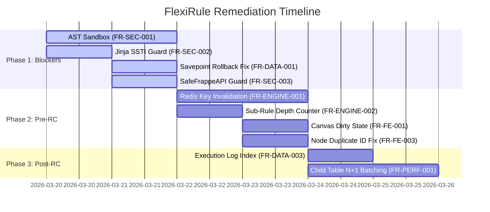

# Remediation Plan — FlexiRule

## 1. Overview & Remediation Strategy

This plan outlines the prioritized sequence of engineering actions required to resolve all findings identified during the FlexiRule code audit. Fixes are categorized by release urgency and dependency relationships.

---

## 2. Phased Remediation Roadmap

---

## 3. Action Items by Phase

### Phase 1: Immediate Blockers (Critical / High Security & Data Integrity)

1. **FR-SEC-001 — AST Validation Engine (`flexirule/ruleflow/core/permissions.py`)**
   - **Action**: Replace syntax-only `compile()` in `validate_safe_eval()` with an `ast.NodeVisitor` that inspects AST trees and rejects dunder attributes (`__subclasses__`, `__class__`, `__globals__`), import statements, and function calls before evaluation.
   - **Dependencies**: None.

2. **FR-SEC-002 — Jinja Context Sandboxing (`flexirule/ruleflow/core/action_handlers/document_action.py`)**
   - **Action**: In `_render_scalar()`, replace global `frappe` module injection in `_template_context()` with a restricted dictionary containing only `doc` and `vars`.
   - **Dependencies**: None.

3. **FR-SEC-003 — SafeFrappeAPI Parameter Guard (`flexirule/ruleflow/core/engine.py`)**
   - **Action**: In `SafeFrappeAPI.format_value()`, verify `df` is a valid `DocField` object from `frappe.get_meta()`, rejecting dict overrides.
   - **Dependencies**: None.

4. **FR-DATA-001 — Savepoint Rollback Failure Fallback (`flexirule/ruleflow/core/engine.py`)**
   - **Action**: In `RuleEngine._execute_graph()`, catch savepoint rollback exceptions and issue a full `frappe.db.rollback()` to abort the transaction cleanly.
   - **Dependencies**: None.

---

### Phase 2: Pre-RC / Production Readiness (High Engine & Frontend Defect Fixes)

5. **FR-ENGINE-001 — Exact Redis Cache Key Deletion (`flexirule/ruleflow/core/action_plan_cache.py`)**
   - **Action**: Track active plan version key hashes in a Redis set per rule and delete exact keys via `frappe.cache.delete_value()`.
   - **Dependencies**: Phase 1 completed.

6. **FR-ENGINE-002 — Sub-Rule Recursion Depth Counter (`flexirule/ruleflow/core/action_handlers/sub_rule.py`)**
   - **Action**: Pass `_sub_rule_depth = context.get("_sub_rule_depth", 0) + 1` into child `RuleEngine` instances and throw `SubRuleRecursionLimitError` if depth > 2.
   - **Dependencies**: None.

7. **FR-FE-001 — VueFlow Canvas Initial Render Position Sync (`flexirule/public/js/.../useRuleStore.js`)**
   - **Action**: In `useRuleStore.js:fetch()`, call `sync_initial_state_positions()` or `clear_dirty()` inside `nextTick()` after layout calculation.
   - **Dependencies**: None.

8. **FR-FE-003 — Canvas Node Duplication Action ID Regeneration (`flexirule/public/js/.../useGraphStore.js`)**
   - **Action**: In `useGraphStore.js:duplicateNode()`, regenerate a unique `action_id` for duplicated node data.
   - **Dependencies**: None.

---

### Phase 3: Post-RC & Operational Quality (Performance & Maintainability)

9. **FR-DATA-003 — Execution Log Database Index (`flexirule/ruleflow/doctype/rule_execution_log/rule_execution_log.json`)**
   - **Action**: Set `"search_index": 1` on `execution_id` in `rule_execution_log.json`.
   - **Dependencies**: None.

10. **FR-PERF-001 — Child Table Mapping Batch Querying (`flexirule/ruleflow/core/action_handlers/document_action.py`)**
    - **Action**: Batch fetch linked rates/fields prior to looping through child table rows in `_apply_table_mappings()`.
    - **Dependencies**: None.

11. **FR-DOC-001 — Documentation Alignment Update (`flexirule/ruleflow/README.md`)**
    - **Action**: Update documentation to accurately describe sub-rule recursion limits, action config mode options, and dry-run logging mechanics.
    - **Dependencies**: Phase 2 completed.
