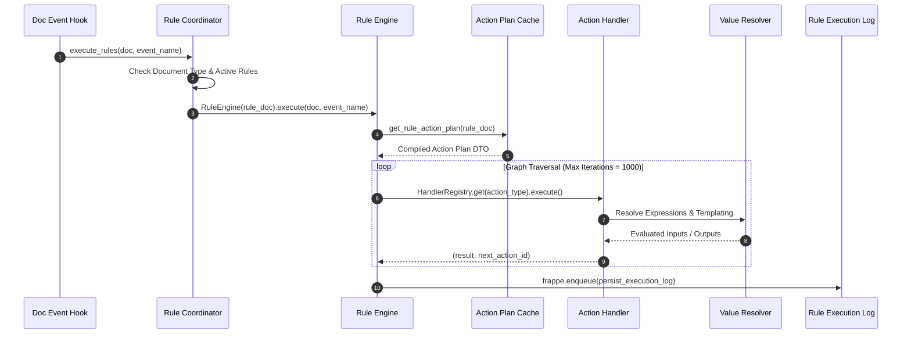

# Rule Engine Audit — FlexiRule

## 1. Overview & Runtime Architecture

The FlexiRule runtime engine (`flexirule/ruleflow/core/engine.py`) orchestrates execution of rule graphs. When a document event or scheduler trigger fires:
1. `RuleCoordinator` fetches candidate active `Rule` records matching `document_type` and `trigger_event`.
2. Filter conditions (`trigger_condition` / `compiled_expression`) are evaluated using `frappe.safe_eval`.
3. `RuleEngine` is instantiated with the `Rule` document and execution context (`doc`, `old_doc`, `vars`, `meta`).
4. `RuleEngine._execute_graph` executes graph traversal via `HandlerRegistry` using top-level step iteration.



---

## 2. Detailed Findings

### Finding FR-ENGINE-001 (HIGH) — Unenforced Sub-Rule Recursion Depth Limit
- **Files**: `flexirule/ruleflow/core/engine.py`, `flexirule/ruleflow/core/action_handlers/sub_rule.py`
- **Description**: Sub-rule calls do not pass or increment recursion depth counters.
- **Technical Analysis**: `engine.py` defines `MAX_SUB_RULE_DEPTH = 2`, but `SubRuleHandler` instantiates new `RuleEngine` instances without passing `_sub_rule_depth` inside `execution_context`. If sub-rules reference each other dynamically (for example, Rule A calling Rule B which calls Rule A under specific runtime conditions), execution causes infinite recursion or stack overflow crashes rather than throwing `SubRuleRecursionLimitError`.
- **Impact**: Server crash / stack overflow on dynamic sub-rule recursion.
- **Remediation**:
  ```python
  # In SubRuleHandler.execute:
  current_depth = context.get("_sub_rule_depth", 0)
  if current_depth >= MAX_SUB_RULE_DEPTH:
      raise SubRuleRecursionLimitError(f"Sub-rule recursion limit ({MAX_SUB_RULE_DEPTH}) exceeded")
  sub_context["_sub_rule_depth"] = current_depth + 1
  ```

---

### Finding FR-ENGINE-002 (HIGH) — Asynchronous Document Actions Mask Worker Failures
- **File**: `flexirule/ruleflow/core/action_handlers/document_action.py`
- **Function/Class**: `DocumentActionHandler._create_new`
- **Description**: Asynchronous document creation reports success before execution occurs.
- **Technical Analysis**: When `is_async=1`, `_create_new` enqueues document creation via `frappe.enqueue("_async_create_doc")` and immediately returns `{"enqueued": True}`. The `RuleEngine` records `status="success"` in the `Rule Execution Log`. If the background worker fails (due to missing mandatory fields or validation errors), the execution log continues to show successful completion.
- **Impact**: Misleading execution logs; silent background job failures.
- **Remediation**: Store the background job ID in `vars` and track background job status in `Rule Execution Log`.

---

### Finding FR-ENGINE-003 (MEDIUM) — Inconsistent Default Branch Execution in Switch Handler
- **File**: `flexirule/ruleflow/core/action_handlers/switch.py`
- **Function/Class**: `SwitchHandler.execute`
- **Description**: Unmatched `Switch` cases fall back to `next_step_if_true` without warning.
- **Technical Analysis**: `SwitchHandler` evaluates case expressions. If no case matches and no explicit `default` case is configured in `config.cases`, it returns `action.next_step_if_true`. Unlike `ConditionHandler` which explicitly branches on `next_step_if_false`, `SwitchHandler` implicitly defaults to `next_step_if_true`, causing confusing workflow branching when rule authors omit a default case.
- **Impact**: Unexpected branch traversal in `Switch` nodes.
- **Remediation**: Use `next_step_if_false` as the default fallback branch and log an `INFO` message when no case matches.

---

### Finding FR-ENGINE-004 (MEDIUM) — Active Rule Cache Invalidation Race Condition
- **File**: `flexirule/ruleflow/core/coordinator.py`
- **Function/Class**: `RuleCoordinator.clear_cache`
- **Description**: Cache invalidation only clears local thread state.
- **Technical Analysis**: `RuleCoordinator.clear_cache()` deletes `frappe.local.flexirule_rule_cache`. In multi-worker Gunicorn/uWSGI deployments, activating or deactivating a rule on Worker A clears Worker A's local cache, but Workers B and C continue serving stale rule instances from their local process memory until process restart or site reload.
- **Impact**: Inconsistent rule execution across web workers.
- **Remediation**: Broadcast cache invalidation via Redis Pub/Sub (`frappe.publish_realtime` or Redis cache keys).
