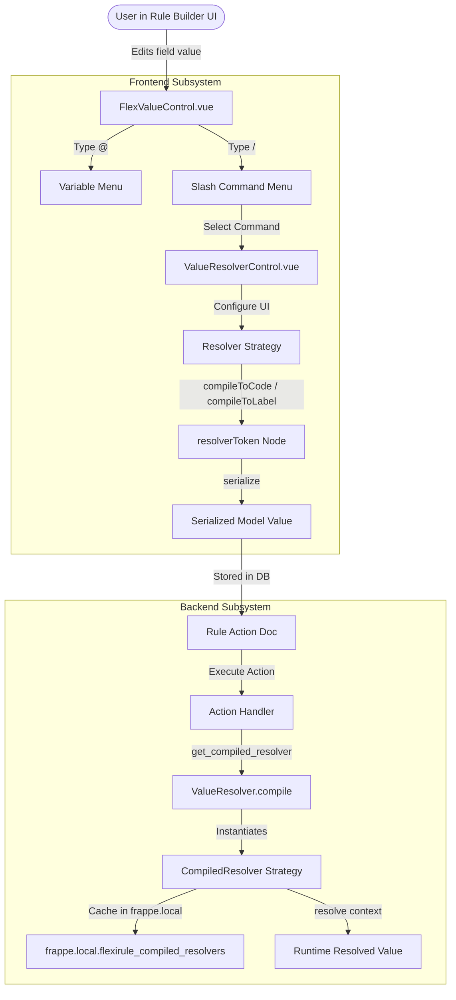

# FlexiRule Value Resolver Audit Report Index

## Overview

This repository contains a comprehensive audit of the **Value Resolver** subsystem in FlexiRule (Frappe v15+). The audit covers both frontend (Vue 3 / Tiptap / Pinia) and backend (Python / SafeEval / Jinja) architectures, data serialization contracts, fieldtype support, security enforcement, test coverage, and findings.

---

## Navigation & Structure

| Report File | Description |
| :--- | :--- |
| **[1. Executive Summary](executive-summary.md)** | Key conclusions, executive answers, architectural risks, and release readiness. |
| **[2. Resolver Inventory](resolver-inventory.md)** | Definitive inventory table and detailed matrix of all 9 canonical resolvers + internal fallbacks. |
| **[3. Frontend Architecture](frontend-architecture.md)** | Deep trace of `FlexValueControl.vue`, Tiptap `/` slash commands, `ValueResolverControl.vue`, strategies, and token modals. |
| **[4. Backend Architecture](backend-architecture.md)** | Backend evaluation pipeline, `ValueResolver.compile()`, compiled strategy classes, request-local caching, and context resolution. |
| **[5. Frontend-Backend Contract](frontend-backend-contract.md)** | Detailed payload mapping, contract schemas, legacy mode coercion, and data model compatibility analysis. |
| **[6. Resolver Types Deep Dive](resolver-types.md)** | End-to-end documentation for every individual resolver kind (UI access, config schema, compiled expression, backend execution, tests). |
| **[7. Fieldtype Support](fieldtype-support.md)** | Compatibility matrix mapping Frappe fieldtypes to allowed resolver kinds, command palette options, and backend handling. |
| **[8. Security Audit](security-audit.md)** | Security evaluation of Python safe_eval, Jinja SSTI context safety, database access, and UI-only level restriction enforcement gaps. |
| **[9. Testing Audit](testing-audit.md)** | Inventory of unit, complex, and integration tests, coverage gaps, and recommended test additions. |
| **[10. Documentation Audit](documentation-audit.md)** | Audit of repository documentation vs actual code implementation and discrepancies. |
| **[11. Findings](findings.md)** | Itemized audit findings (`VR-AUDIT-001` through `VR-AUDIT-008`) with severity, evidence, impact, reproduction, and remediation. |
| **[12. Technical Remediation Plan](remediation-plan.md)** | Prioritized technical roadmap to address contract mismatches, security gaps, and architectural debt before release. |

---

## Architectural Summary Diagram

